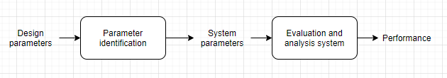

# Title: Performance evaluation and analysis of blimp design
3-5 word title

### Summary:
This project aims to develop a evaluation pipeline that is able to identify the design parameters of blimps autonomously and  provide a evaluation and analysis of a particular customized blimp design. 

### Splash images

### Project git repo(s):
[https://git.uclalemur.com/ljhnick/foray](https://git.uclalemur.com/ljhnick/foray)

[https://github.com/zhz03/209_project_Blimp_modelling](https://github.com/zhz03/209_project_Blimp_modelling)

## Big picture 

### What is the overall problem that this and related research is trying to solve?

There are many blimp design since last century. Most of them were focused on the outdoor, huge blimp designs. The overall problem about blimp design is how do develop a safer, reliable, easy to control blimp that can be both fast and agile. 

### Why should people (everyone) care about the problem?

LTAVs have advantages of staying in the air for a long time. This characteristic enable us to proceed many tasks like motion control, indoor communication, outdoor risk and danger surveillance and so on. However, to design a safe, reliable and customized blimp that could proceed these tasks and meet our needs require lots of engineering efforts. We want to develop a blimp design pipeline that could transfer intuitive thoughts in people's minds into engineering design and could automatically evaluate these designs and analyze the performance of this design. 

### What has been done so far to address this problem?

There are lots of blimp design in this field. 

As for blimp design, an efficient physics-based dynamic modelling of indoor airships including a pragmatic methodology for parameter identification without the need for complex or costly test facilities was presented by Zufferey et al. M. Burri et al. presented a novel spherical omnidirectional blimp. Tao et al. presented the identification of the rotation-related parameters of the blimp dynamics model through swing motion of the robot.  

As for blimp control, Wang et al. presented an altitude controller for an indoor blimp. Hiroaki Fukushima et al presented a model predictive control method of an autonomous blimp.   

As for blimp perception, Ningshi Yao et al. presented an approach that utilized monocular camera to allow blimp to detect and follow human.

There are no specific research that really focus on the blimp design pipeline and its evaluation, analysis system. 

## Specific project scope

### What subset of the overall big picture problem are you addressing in particular?

While the bigger picture is to focus on the design problem of blimps. We would like to narrow down this problem a little bit. We focus on developing a design tool that help to design indoor, general, safe, customized blimps. To be more specific, there are three parts of solving this problem. 

- The first part is to developing a human interface that could transfer intuitive visualized design into system parameters by analyzing geometry features or extracting customized information.
- The second part is to develop a evaluation and analysis system that could evaluate an could evaluate the performance of designed blimp based on their design parameters. (What is the optimal configuration to follow the trajectories.)
- The third and final part is to develop an optimized system that could automatically refine and modify the preliminary human design and controller design to gain a better performance. 

### How does solving this subproblem lead towards solving the big picture problem?

These subproblems actually cover all the procedure in the general design pipeline, which is human design, performance analysis, design optimization. Therefore, we believe this could solve the big problem we proposed.

### What is your specific approach to solving this subproblem?

Since we're now solving the second problem. I would mainly talk about our approach to solving this problem. 

We will combine simulation with real-world experiment to solve this problem. In our simulation, we will build up a mathematical model to explore the functional relationship between design parameters and the performance of the blimps. In the real-world experiment, we will test different subjects with different design parameters to verify our simulation and evaluation system. 

### How can you be reasonably sure this approach will result in a solution?

Our evaluation system has to be robust enough in order to evaluate and analyze the performance of different types of blimps. Therefore, only consider the simulation is not enough, even the mathematical model is sound but it needs hypothesis. By conducting real-world experiment, we will know how to remove those hypotheses and use experiment results to support or to verify our evaluation system. 

### How will we know that this subproblem has been satisfactorily solved, using quantitative metrics?

We have two ways for us to verify our system. 

One is to self-verification, we will conduct different experiments on the different blimps that have different design parameters. We will explore their performance in the real-world and compare that result with the one that generated from our evaluation system.

The second way is to check based on other people's designs. The purpose of this project is more design, evaluation and analysis as efficient and easy as possible, even for non-experience users.  We will invite a non-experience use to design his customized blimp, we will use the design parameters from his blimp and test its performance. 

## Broader impact
(even if someone doesn't care about the big picture problem that you started with, why should they still care about the specific work that you've produced?  Who else can use your processes and results, and how?)

### What is the value of your approach beyond this specific solution?

By using our design, any non-experience user could evaluate their own blimp design without putting to much engineering efforts. 

### What is the value of this solution beyond solely solving this subproblem and getting us closer to solving the big picture problem?

With this evaluation and analysis system, we could quickly and efficiently analysis the performance of our designed blimp instead of running a real experiment, which requires a lot of engineering efforts. 

## Background / related work / references
Link to your literature review in your repo.

https://www.overleaf.com/project/5dd213d2bdff3e00015e5fc6

## Goals, deliverables, tasks

### Concrete external deadlines (paper submissions):
Include dates as well as target proposed title / abstract for expected submission

IROS 2021. Deadline: March 2021

### Detailed schedule (weekly goals / deliverables / tasks):
Link to schedule in your repo.

#### Week8: (Nov. 22 - 28)

##### Goals:

- To have the ability to identify inputs and outputs of blimp model

##### Deliverables: 

- A document that describes inputs and outputs of the system

##### Tasks: 

- Write down the google doc that contains inputs and outputs of the system

#### Week9: (Nov. 29 - Dec. 5)

##### Goals:

- To have the ability to integrate existing solution into our system 
- To have the ability to compare our model with other models

##### Deliverables: 

- Evaluation for gazebo (for everyone)
- Python modules (Drag[Yifei Chen], Buoyancy + geometry inputs[Hongyi Li], Propulsion [Zeyu Wang],Kinematic + mass matrix[Kyle Lei]) 
- Paper introduction[zhaoliang] 

##### Tasks: 

- Download the ROS ready-to-go version UBUNTU virtual machine
- Test existing gazebo model and make it up and running
- Build individual modules for inputs and outputs
- Write down the introduction for IROS paper

#### Week10: (Nov. 6 - 12)

##### Goals:

- To demonstrate our milestone progress 

##### Deliverables: 

- Project presentation video

##### Tasks: 

- Test built modules
- Write down the video script
- Record presentation video for project

#### Week11: (Nov. 13 - 19)

##### Goals:

- To demonstrate what we got and capture them in the project

#### Deliverables:

- Project report as first milestone of IROS paper

##### Tasks:

- Finish the Abstract of the report
- Finish the method part of the report
- Finish the simulation of the report
- Finish the conclusion of the project

 

