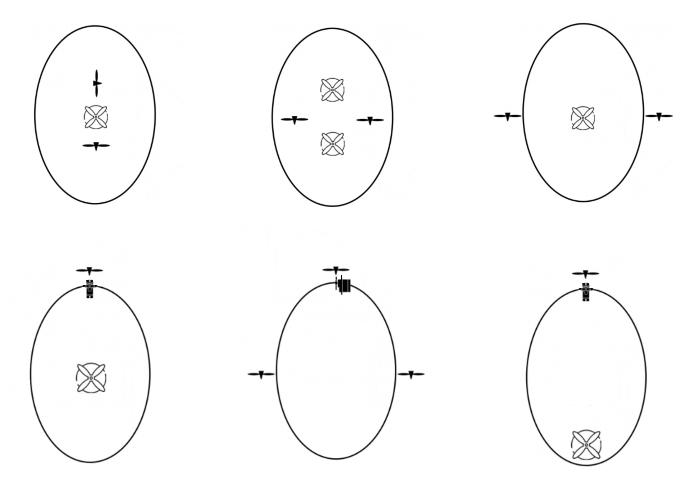
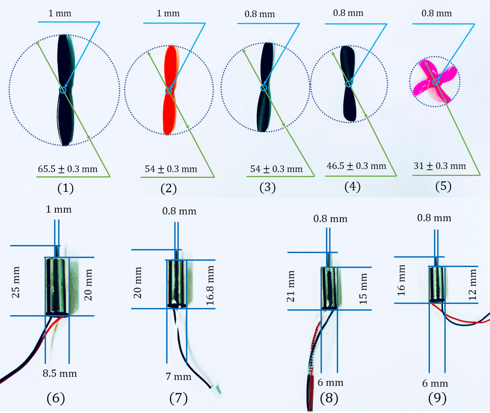
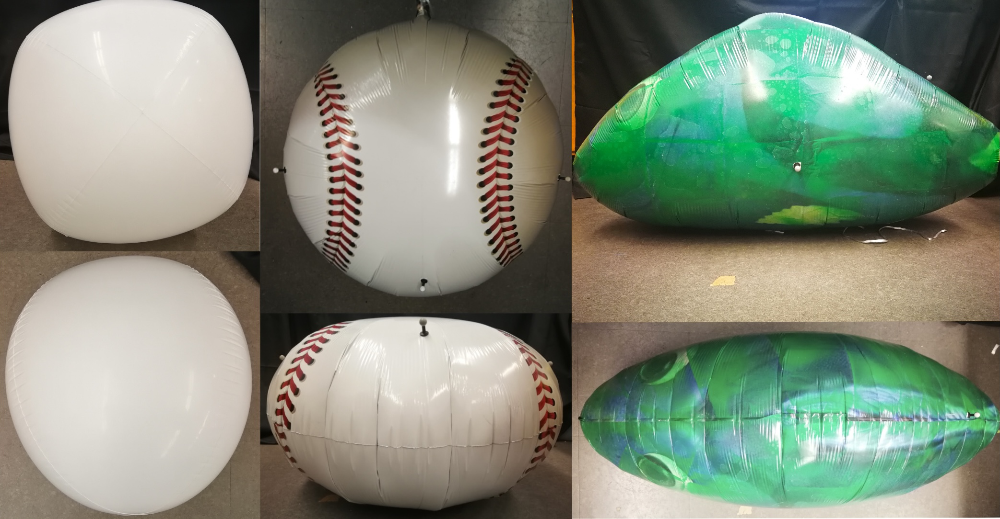
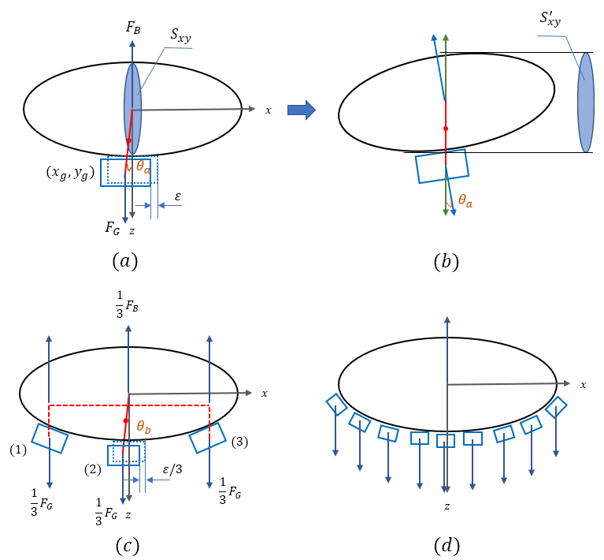

# FORAY project

## Content

- Goals
- Contributions of the paper
- Paper deliverables
- Engineering deliverables
- Phased plan 
- Detailed schedule 

## Goals

- To design a fleet of autonomous blimps to join the competition and demonstrate the capability of our research
- To finish the research paper, which is about preemptively evaluating the performance of the desired airships. 

## Contributions of the paper

- Design a modular reconfigurable airship that allow users to design their own custom blimp 
- Explored  the  user-based  design  parameters  space  that considers different user configurations including thrust distribution,  propulsion  combination,  balloon  shapes  and  weight distribution 
- Proposed a custom blimp design evaluation system that takes  in  the  design  parameters  and  output  the  steady-state performance of that particular blimp design 

## Paper Deliverables

- As for the modular reconfigurable airship
  - Reconfigurable structure including centralized and decentralized gondola and motor support which could support multiple motors or servo around or centered on the airship: 3D printed gondola or origami structure, 3D printed motor support. 
  - Reconfigurable integrated electronics: custom PCB design (8 motors outputs + 4 servo motors outputs), different sensors outputs (cameras, lidar sensor et al.)
  - Reconfigurable software system: user-friendly functions and easy to deploy and match the hardware system
    - All the functions of control and sensors will be decoded and integrated into some individual functions (e.g. move_forward(speed); time_sleep(time); forward_match(motor port) )
    - All of these functions will be integrated into a class (e.g. lemurblimp class that contains tele-op control, activate sensors, communications and so on) 
    - In this way, people will be easier to re-design their code to match the hardware setup. For example, if people use different motor port and servo port to make their blimp move forward, it should be easy enough to modify in the software level. 
  
- As for the high-level parameters space, we need to set up a series of experiment to verify that:
  - Thrust distribution verification: we will keep propulsion, shape and weight distribution as the same and verify the impact of different thrust distribution on blimp performance. 
  
    
  
    - Figures that show the different performance differences (velocity/acceleration) after we change different thrust distribution. A figure to show different velocity/acceleration with error bars between multiple different design with different thrust distribution. 
    - A figure to show the battery, current and force situation for different thrust distribution. 
  
  - Propulsion verification: we will keep other variables as the same and verify the impact of different propulsion method on blimp performance. 
    
    
    
    - Figures that show the different performance differences (velocity/acceleration) after we change different motors+propellers. A figure to show different velocity/acceleration with error bars between multiple different design with different propulsion. 
    - A figure to show the battery, current and force situation for different propulsion. 
    
  - Shape verification: we will keep other variables as the same and verify the the impact of different shape (oval shape, saucer-shape and so on) on blimp performance. 
    
    
    
    - Figures that show the different performance differences (velocity/acceleration) after we change different shapes. A figure to show different velocity/acceleration with error bars between multiple different design with different shapes. 
    - A figure to show the payload, battery situation on different blimps with different shape. 
    
  - The weight distribution verification: we will keep other variables as the same and verify the impact of weight distribution (centralized and decentralized) on blimp performance. 
    
    
    
    - Figures that show the different performance differences (velocity/acceleration) after we change different weight distribution. A figure to show different velocity/acceleration with error bars between multiple different design with different weight distribution.
    - A figure to show the stability situation (swing motion) between different weight distribution design. 
- As for the evaluation system:
  - The code should consider all the high-level parameters as well as the low-level parameters. 
  - The high-level parameters should be given by users and transferred into low-level parameters that are processed by the evaluation system. 
  - The output of the evaluation system should be the performance impact of blimps with different high-level parameters.

## Engineering deliverables

- Our own PCB design and hardware
- Our easy-to-deploy control software system that could match different configuration setup
- A integrated system that has :
  - reconfigurable capability that allow us to test different high-level design
  - Cameras that could give help our blimp to realize its autonomous capability
  - Other sensors (e.g. IMU, barometer, lidar and so on) that could give our blimp the capacity to monitor its own situations

## Phased plan

| Time               | Goals                                                        | Tasks/Deliverables                                           | check point        |
| ------------------ | ------------------------------------------------------------ | ------------------------------------------------------------ | ------------------ |
| May  1 - June 1    | Finish JINT paper and preparation for FORAY following plan   | - JINT paper finished and send out; - All the purchase for FORAY project and sort out what comes back from IU | June 1             |
| June 1 -  July 1   | -Master PCB design knowledge and software - Case study on different opensource PCB design and design our own PCB | - Finish the PCB design course - Finish our own PCB design - PCB schematic .sch file; - PCB board .brd file | July 1             |
| July. 1 - July. 15 | - Have our own electronics  platform and meet all our requirements | - It needs to iterate with factory (debugging) - Solder all the PCB hardware and check all the circuits on board | Aug. 1             |
| July. 16 - Sep. 1. | - Test if all the electronics component works fine on our PCB board - Finish the all the experiment that proves the FORAY paper; - Finish the FORAY paper | - Finish testing PCB board; - Finish testing camera module; - Finish testing IMU module; -Finish testing barometer module; - Finish testing communication module; - Finish all the verification experiments - Videos to show the manual control of our own system - videos to show how all the components work on our blimp | Sep. 1             |
| Sep. 1 - Oct. 1    | - FORAY paper one week internal review; - The ability to test the integrated system and algorithms on board | - Send out the draft for internal review; - Finish the integrated system testing; - Start to test our algorithms on board; - Videos to show how our algorithms works on our system | Sep. 9  and Oct. 1 |
| Oct. 1 - Nov. 1    | - To have the ability to know how to debug and improve our system | - Test the system in a real scenario; - To have the capture cage and blimps with two different colors | Nov. 1             |
|                    | Final preparation for the Nov competition                    |                                                              |                    |

## Detailed schedule (weekly goals / deliverables / tasks):

| Date         | Goals                                                        | Tasks                                                        | Deliverables                                                 |
| ------------ | ------------------------------------------------------------ | ------------------------------------------------------------ | ------------------------------------------------------------ |
| Sat, June 5  | Mater the relevant knowledge of PCB design                   | Take online circuit courses                                  | A blog post to show what I've learned in that week           |
| Sat, June 12 | Master the Altium designer software                          | Take Altium designer course                                  | A blog post to show what I've learned in that week           |
| Sat, June 19 | Case study on opensource PCB design                          | - decode other people's schematics and modify their design - Check my understanding with Dr. Yang Zhang | Some case study report of other PCB design                   |
| Sat, June 26 | Finish our PCB design based on our requirements              | - Finish our own PCB design - Meet with expert like Dr. Yang Zhang to discuss details about it | - PCB schematic .sch file; - PCB board .brd file             |
| Sat, July 3  | PCB iteration and debugging                                  | - iterate with factory                                       | A prototype PCB board                                        |
| Sat, July 10 | Prototype checking and debug                                 | - debug our PCB design                                       | A better version of PCB board                                |
| Sat, July 17 | Soldering and checking                                       | - Solder all other components and circuit final check - Start building custom Mylar balloons (2days/per balloon) | The final version of PCB design                              |
| Sat, July 24 | - Test the functionality of our PCB - Setup the opti-track system for real-time data processing | - Test the control code and test if PCB could outputs the exact voltage and current after we connect motors to it; - Upload code to that board and check IMU data (whether the error is within the require range) - Upload code and Check the lidar and camera situation - Test communication situation (any latency or the sensing range) - Write a python code to process the real-time data and test that in the lab (get ready for future experiments) | A blog post to summarize all the situation                   |
| Sat, July 31 | Thrust distribution experiments and verify that part of evaluation system | We will keep propulsion, shape and weight distribution as the same and verify the impact of different thrust distribution on blimp performance: - Change the thrust distribution and use opti-track system to capture their steady-state performance (arrange 6 different designs and for each design conduct 10 different round of experiments) - Monitor the battery, current situation - Data analysis | - Figures that show the different performance differences (velocity/acceleration) after we change different thrust distribution. A figure to show different velocity/acceleration with error bars between multiple different design with different thrust distribution. -  A figure to show the battery, current and force situation for different thrust distribution. |
| Sat, Aug. 7  | Propulsion experiments and verify that part of evaluation system | We will keep other variables as the same and verify the impact of different propulsion method on blimp performance. - Change the motors+propellers combination and use opti-track system to capture their steady-state performance - Monitor the battery, current situation on board - Data analysis | - Figures that show the different performance differences (velocity/acceleration) after we change different motors+propellers. A figure to show different velocity/acceleration with error bars between multiple different design with different propulsion.  - A figure to show the battery, current and force situation for different propulsion. |
| Sat, Aug. 14 | Shape experiments and verify that part of evaluation system  | We will keep other variables as the same and verify the the impact of different shape (oval shape, saucer-shape and so on) on blimp performance.  - Change the different shape and use opti-track system to capture their steady-state performance - Monitor the payload situation - Data analysis | - Figures that show the different performance differences (velocity/acceleration) after we change different shapes. A figure to show different velocity/acceleration with error bars between multiple different design with different shapes.  - A figure to show the payload, battery situation on different blimps with different shape. |
| Sat, Aug. 21 | Weight distribution experiment and verify that part of evaluation system | The weight distribution verification: we will keep other variables as the same and verify the impact of weight distribution (centralized and decentralized) on blimp performance. - Change the weight distribution and use opti-track system to capture their steady-state performance - Monitor the stability situation (oscillation) - Data analysis | Figures that show the different performance differences (velocity/acceleration) after we change different weight distribution. A figure to show different velocity/acceleration with error bars between multiple different design with different weight distribution. A figure to show the stability situation (swing motion) between different weight distribution design. |
| Sat, Aug. 28 | Writing the paper                                            | - Add new content to the paper - process the data and make beautiful figures - Ask for feedback and comments | Paper draft                                                  |
| Sat, Sep.  4 | Finalize the paper and internal review                       | Send it our to all authors and the group to ask for their reviews and comments | A Finish manuscript                                          |
| Sat. Sep. 11 | Testing feedback control algorithm on board                  | - altitude feedback control                                  |                                                              |

