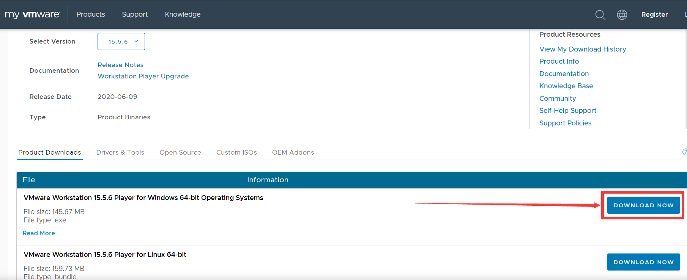
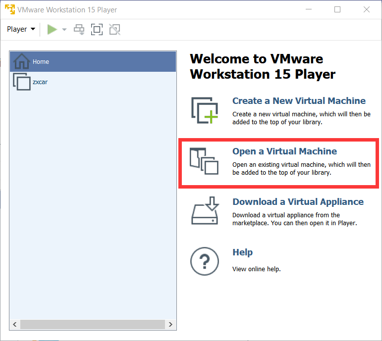
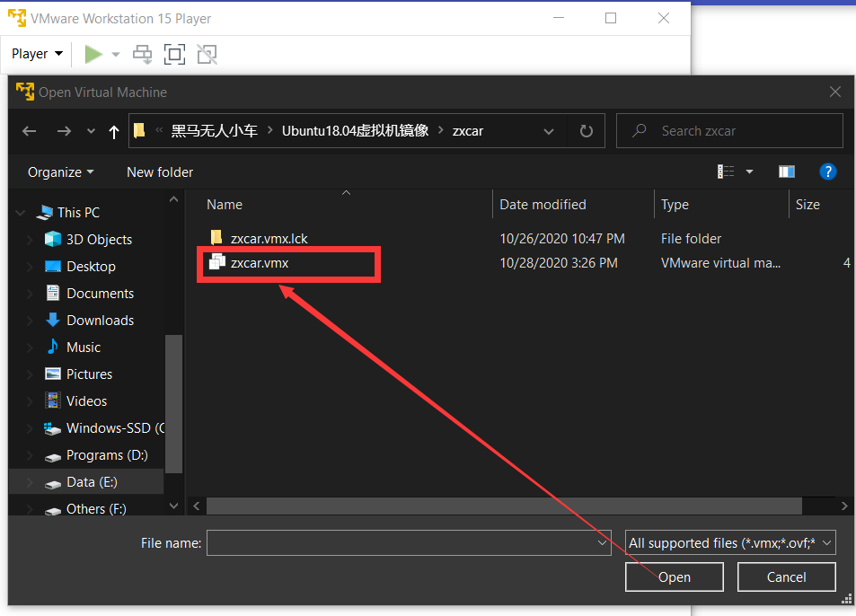
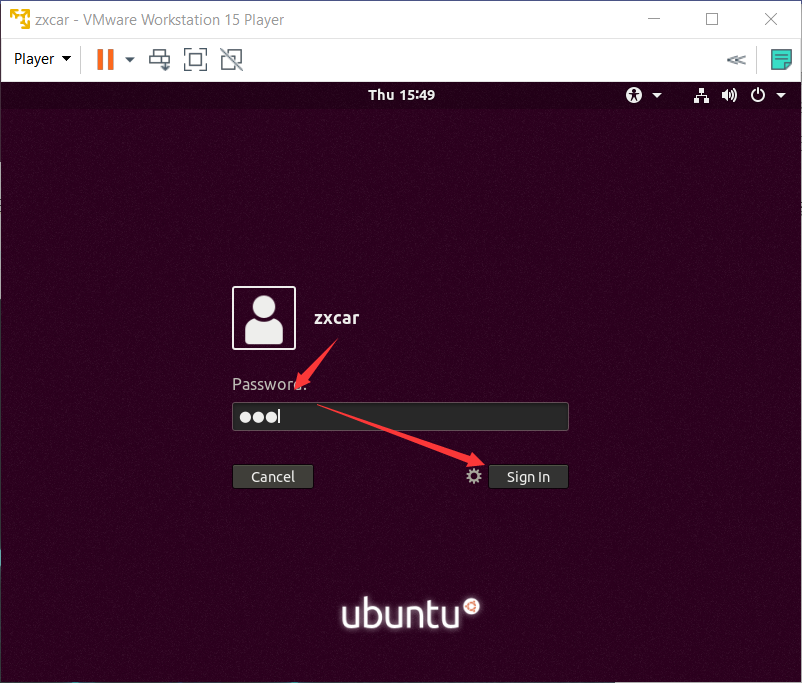

# Install Virtual Machine

## Download virtual machine 

download VMware virtual machine software(Window10-x64) [link](https://my.vmware.com/en/web/vmware/downloads/details?downloadGroup=PLAYER-1556&productId=800&rPId=47861)

## Using ROS ready-to-go Ubuntu system

The ready-to-go Linux system version is Ubuntu 18.04.5 LTS, it includes the following environment and tools:

- clion 2019.3
- pycharm 2019.3
- amacpmda
- ros (melodic)
- terminator multiple-windows terminal 
- chrome 
- sogoupinyin (Chinese keyboard)

It has been configured global Ali data source 

### Step-by-step process:

1. Go the the shared google drive and download VM package:

   https://drive.google.com/drive/folders/1pQIc64VEQB58DwDCWm181PesGNF_KXpc

2. Unzip the virtual machine package:

   Use the one that you download from the drive, unzip **zxcar.zip**

3. Open VMware workstation player 

   In the VMware main page, **Open a Virtual Machine** 

   

   find out the unzipped file **zxcar.vmx**, click that and open it

   

   choose the VM that you just added, and click **Play virtual machine**

   

   after you activate this machine, if you see "this virtual maybe moved or copy", click "I've copied this virtual machine"

   and if you see it asks that Do you wan to try to connect this virtual device, click "No"

4. Log in Ubuntu system

   After you get into the system, chose zxcar, and the password is "123", click **Sign in**

   

   Then we are good to go

